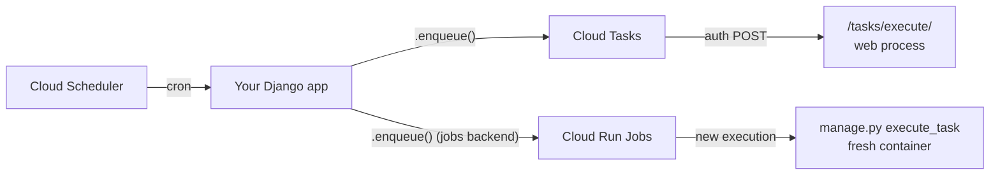

# django-tasks-google

Run Django tasks on Google Cloud using Cloud Tasks, Cloud Run Jobs, and Cloud Scheduler,
without managing workers or leaving Django.

[](https://pypi.org/project/django-tasks-google/)
[](https://pypi.org/project/django-tasks-google/)
[](https://docs.djangoproject.com/en/6.0/topics/tasks/)
[](https://github.com/novucs/django-tasks-google/actions/workflows/ci.yml)
[](LICENSE)

Built on Django 6.0's Task Framework (`django.tasks`).

## What it does

- Routes each task to the right Google Cloud service:
    - **Cloud Tasks** for async work
    - **Cloud Run Jobs** for long-running and batch jobs
    - **Cloud Scheduler** for cron
- Persists status, results, and errors as `TaskExecution` rows in your database
- Prevents duplicate work with idempotency keys and lease-based execution
- Detects stalled tasks with heartbeats and retries safely across crashes and timeouts
- Lets you manage scheduled tasks from the Django admin

## Who it's for

Teams who are already on Google Cloud, prefer fully managed infrastructure (no workers or
brokers to run), and want to use Django's built-in task framework.

## Install

```bash
pip install django-tasks-google
```

## Quickstart

The fastest way to try django-tasks-google is locally, with no Google Cloud setup, using
`ProcessBackend` - see [Local development](docs/local-development.md).
The steps below run it on Google Cloud, which also means deploying your app and creating a
queue and IAM; do those first, following
[Deploying to Google Cloud](docs/deployment.md).

**Prerequisites:** a Google Cloud project with Cloud Tasks / Cloud Run / Cloud Scheduler
enabled, and a service account with the Cloud Run Invoker (`roles/run.invoker`) role.

**1. Add the app** to `INSTALLED_APPS`:

```python
INSTALLED_APPS = [
    "django_tasks_google",
]
```

**2. Run migrations** to create the task tables:

```bash
python manage.py migrate
```

**3. Configure a backend** in your settings:

```python
TASKS = {
    "default": {
        "BACKEND": "django_tasks_google.backends.CloudTasksBackend",
        "QUEUES": ["default"],
        "OPTIONS": {
            "project_id": "your-project-id",
            "location": "us-central1",
            "base_url": "https://your-app.run.app/tasks/",
            "oidc_service_account": "task-invoker@your-project-id.iam.gserviceaccount.com",
            # Map the logical "default" queue to the real Cloud Tasks queue you create.
            "queue_aliases": {"default": "your-cloud-task-queue-name"},
        },
    },
}
```

**4. Mount the URLs** that receive task requests:

```python
from django.urls import include, path

urlpatterns = [
    path("tasks/", include("django_tasks_google.urls")),
]
```

**5. Define a task, enqueue it, and read the result:**

```python
from django.tasks import task, TaskResultStatus


@task
def send_notification(user_id: int):
    return {"user_id": user_id, "status": "sent"}


# Enqueue it. This returns immediately; the task runs on Google Cloud.
result = send_notification.enqueue(user_id=1)

# It usually hasn't finished yet. The result lives in your database, keyed by result.id.
# Re-fetch and refresh later (poll, or load it where you need the outcome) to see how it went.
result.refresh()
print(result.status)  # READY, RUNNING, SUCCESSFUL, or FAILED

if result.status == TaskResultStatus.SUCCESSFUL:
    print(result.return_value)  # reading this before the task finishes raises
elif result.status == TaskResultStatus.FAILED:
    print(result.errors)
```

That is the whole loop: define a task, call `.enqueue()`, and it runs on Google Cloud with
its status and result stored in your database. For long-running or batch work, use a
`CloudRunJobsBackend` and select it per task with `@task(backend="jobs")`.

## How it works

Your Django app is deployed where Google Cloud can reach it (typically Cloud Run). When you
call `.enqueue()`, Google Cloud calls back into that same app to run the task:



- **Cloud Tasks** delivers the task as an authenticated POST to `/tasks/execute/`, where it
  runs in your web process. Best for short async work.
- **Cloud Run Jobs** starts a fresh job execution from your app's container image, running
  `manage.py execute_task`. Best for long-running and batch work.
- **Cloud Scheduler** calls `/tasks/schedule/` on a cron schedule, which enqueues the task
  through one of the backends above.

Every inbound request is verified against the configured service account with OIDC, so the
endpoints are safe to expose publicly. The queue and job resources you reference must already
exist in your project (scheduler jobs are created for you), and your retry policy is read from
them (the Cloud Tasks queue's max attempts or the Cloud Run Job's max retries) rather than
configured here. The web service and the jobs share one database (supporting row-level
locking) and coordinate through it.

See [Deploying to Google Cloud](docs/deployment.md)
to create these resources, and
[Configuration](docs/configuration.md)
for every option.

## Documentation

- [Deploying to Google Cloud](docs/deployment.md) - create the queue, job, and IAM your backends need
- [Configuration](docs/configuration.md) - every backend option, defaults, and reliability settings
- [Local development](docs/local-development.md) - run tasks on your machine with `ProcessBackend`
- [Scheduling (cron)](docs/scheduling.md) - recurring tasks via Cloud Scheduler
- [Cancelling tasks](docs/cancellation.md) - graceful and forceful cancellation
- [Observability](docs/observability.md) - OpenTelemetry tracing

## Data model

- `TaskExecution` - execution metadata, status, results, and errors
- `ScheduledTask` - cron definitions synced with Cloud Scheduler

Read execution state through the task result API (`result.refresh()`, as shown above). The
Django admin currently exposes `ScheduledTask` only, not individual executions.

## Development

```bash
uv run pre-commit install
uv run pre-commit run --all-files
uv run ruff check .
uv run ruff format --check .
uv run pytest
DJANGO_SETTINGS_MODULE=tests.settings uv run python -m django makemigrations --check --dry-run
```

## References

- [Django Task Framework](https://docs.djangoproject.com/en/6.0/topics/tasks/)
